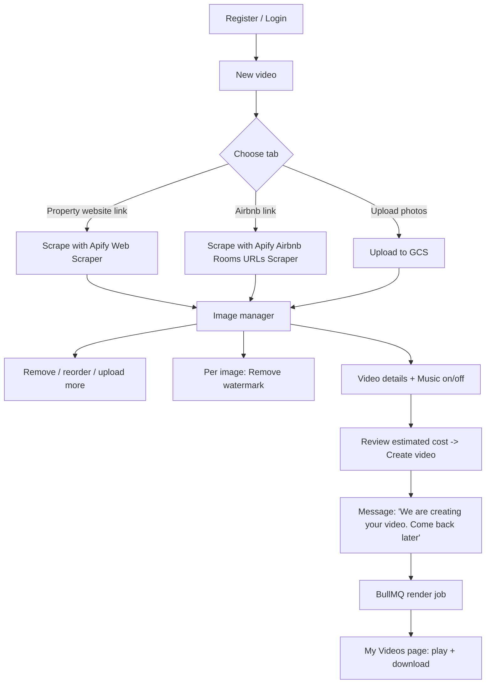
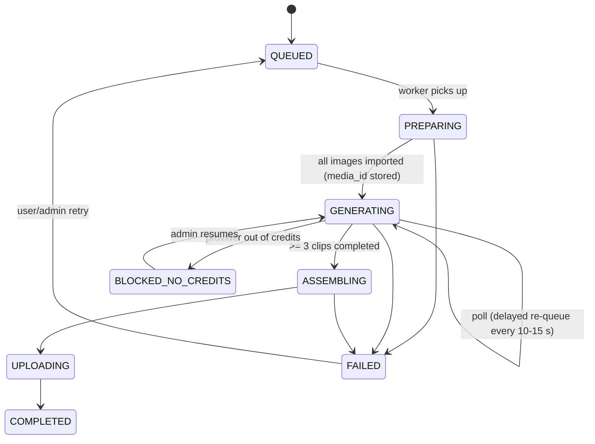

# Product Specification: Real Estate Walkthrough Video App

| | |
|---|---|
| **Working name** | PropertyReel (placeholder) |
| **Version** | 1.0 (draft for build) |
| **Date** | 2 October 2026 |
| **Companion document** | `real-estate-video-app-guide.md` (the "Technical Guide"). This spec references it as **TG §n**. |
| **Proven prototype** | 4 Higgsfield clips + FFmpeg assembly produced a 24 s 1080p MP4 for 30 Higgsfield credits (TG §7). |

---

## 1. Overview

### 1.1 Product summary
A web app where a registered user supplies photos of a property, either by pasting a listing link (a real estate website or an Airbnb listing) or by uploading their own. The user curates the photos (remove, reorder, add more, optionally remove watermarks), chooses whether to include music, and submits. A background job generates a cinematic walkthrough video. The user is told to come back later. Finished videos and the photos used are stored in Google Cloud Storage and are available from a personal page, where they can be played and downloaded.

### 1.2 Goals
1. A user can go from "listing link" to "finished MP4" with no video-editing skills.
2. The user stays in control of which photos are used and in what order.
3. Long-running work never blocks the UI. It runs in BullMQ workers and survives restarts and retries safely.
4. Every finished video and every photo used is stored durably in our Google Cloud and retrievable by the owner only.
5. Cost per video is predictable and capped (Higgsfield credits, Apify, dewatermark credits).

### 1.3 Non-goals (v1)
- Payments, subscriptions, invoicing (usage quotas only, see §14.3).
- Voiceover, captions, vertical/9:16 output, multiple music tracks, custom music upload.
- Manual timeline editing of the final video.
- Team workspaces and sharing links.
- Mobile native apps (the web app must be responsive).

### 1.4 Users
| Persona | Need |
|---|---|
| Real estate agent | Fast, professional listing video from existing listing photos |
| Short-term rental host (e.g. Airbnb) | Promo video from an Airbnb listing |
| Property owner / photographer | Upload own photos and get a video |

### 1.5 Assumptions and decisions taken
These resolve points the brief left open. Change them in review if wrong.

| # | Decision |
|---|---|
| D1 | Three intake tabs: **Property website link**, **Airbnb link**, **Upload photos**. Upload is also available inside the image manager at any time. |
| D2 | Watermark removal runs **when the user clicks it** on an image (async, with before/after preview), not silently at render time. |
| D3 | Min **3**, max **12** images per video (12 matches the Higgsfield batch limit, TG §2 Step 4). |
| D4 | Clips are generated with Higgsfield audio **off**. "Music on" adds our soundtrack in FFmpeg. "Music off" produces a silent video. Behaviour is then identical for every clip. |
| D5 | One active render per user at a time (configurable). |
| D6 | Output is 16:9, 1920x1080, 30 fps, H.264/AAC MP4 (TG §2 Step 6). |
| D7 | Authentication is email + password with email verification. Social login is out of scope. |

---

## 2. End-to-end user flow



Status shown to the user per project: `Draft`, `Fetching photos`, `Ready to edit`, `Queued`, `Creating video`, `Completed`, `Failed`.

---

## 3. Functional requirements

Priority: **M** = must (MVP), **S** = should, **C** = could.

### 3.1 Authentication (FR-AUTH)

| ID | Requirement | Pri |
|---|---|---|
| FR-AUTH-1 | Register with email and password (min 10 chars). Duplicate emails rejected with a generic message. | M |
| FR-AUTH-2 | Email verification link required before the first render. Login works before verification. | M |
| FR-AUTH-3 | Login with email and password. Sessions use httpOnly, Secure, SameSite=Lax cookies (short-lived access token plus rotating refresh token). | M |
| FR-AUTH-4 | Logout revokes the refresh token. | M |
| FR-AUTH-5 | Password reset by emailed one-time link (expires in 1 hour). | M |
| FR-AUTH-6 | Passwords hashed with argon2id. Login rate-limited per IP and per account. | M |
| FR-AUTH-7 | All project, image and video endpoints enforce ownership. A user can never read another user's data or storage objects. | M |

Acceptance: a second user requesting the first user's project, image, or signed URL receives 404.

### 3.2 Project creation and intake (FR-INTAKE)

| ID | Requirement | Pri |
|---|---|---|
| FR-INTAKE-1 | "New video" page shows a tab menu: **Website link**, **Airbnb link**, **Upload photos**. | M |
| FR-INTAKE-2 | Website tab: URL input, validated as http(s). On submit, create a project and enqueue a `scrape` job (§5). | M |
| FR-INTAKE-3 | Airbnb tab: URL input, validated as an `airbnb.*/rooms/<id>` listing URL. Search-result URLs are rejected with a clear message (see §10.1). | M |
| FR-INTAKE-4 | Upload tab: drag-and-drop and file picker. JPG, PNG, WebP. Max 20 MB per file. Min 1024 px on the longest side (warn below, reject below 640 px). | M |
| FR-INTAKE-5 | While scraping, the page shows progress ("Fetching photos...") and updates without a manual refresh. | M |
| FR-INTAKE-6 | Scraped images are downloaded by our worker and **copied to our GCS bucket**. We never hotlink third-party image URLs (they expire and can change). | M |
| FR-INTAKE-7 | If scraping finds zero images or fails, the user sees a clear message and can switch to Upload. | M |
| FR-INTAKE-8 | Scraped listing text (title, location, price, size) pre-fills the "Video details" form (§3.5). The user can edit all of it. | S |
| FR-INTAKE-9 | A rights attestation checkbox is required before the first render of a project: "I own these photos or have permission to use them." | M |

### 3.3 Image manager (FR-IMG)

| ID | Requirement | Pri |
|---|---|---|
| FR-IMG-1 | Shows all images as a responsive thumbnail grid in video order, numbered 1..N. | M |
| FR-IMG-2 | **Reorder** by drag-and-drop (touch supported) with keyboard alternative (move left/right). Order persists immediately. | M |
| FR-IMG-3 | **Remove** an image (soft delete until render submit; storage objects deleted on project deletion). | M |
| FR-IMG-4 | **Upload more** images at any time before submit (same rules as FR-INTAKE-4). | M |
| FR-IMG-5 | Counter and validation: 3 to 12 images required. The Create button is disabled outside that range and explains why. | M |
| FR-IMG-6 | Duplicate detection by perceptual or content hash. Duplicates are flagged, not auto-removed. | S |
| FR-IMG-7 | Optional per-image "Room type" dropdown (Auto, Exterior, Living room, Kitchen, Bedroom, Bathroom, Terrace/View, Other). Used to choose the prompt template (§6.2). Default Auto. | S |
| FR-IMG-8 | Per-image **Remove watermark** action (see §3.4). | M |
| FR-IMG-9 | Large preview (lightbox) of any image, showing original and processed version side by side if present. | S |

### 3.4 Watermark removal (FR-WM)

Uses the Dewatermark API (details in §10.2).

| ID | Requirement | Pri |
|---|---|---|
| FR-WM-1 | Each image has a **Remove watermark** button. Clicking it enqueues an `image-process` job for that image only. | M |
| FR-WM-2 | Image shows state: `none`, `processing`, `done`, `failed`. | M |
| FR-WM-3 | On `done`, the user sees before/after and can **Keep result** or **Revert to original**. The video uses the version currently selected. | M |
| FR-WM-4 | The original is always preserved in storage. Result is stored as a separate object. | M |
| FR-WM-5 | Max 2 removal attempts per image (cost control). Further attempts show a message. | M |
| FR-WM-6 | The Create button is disabled while any image is `processing`. | M |
| FR-WM-7 | The API key is held only on the server and never sent to the browser. | M |
| FR-WM-8 | First use requires acceptance of: "I confirm I have the right to edit these images." The acceptance (user, timestamp, project) is stored. | M |
| FR-WM-9 | On API failure or timeout, show a retriable error. The user can continue without removal. | M |

### 3.5 Video details and options (FR-OPT)

| ID | Requirement | Pri |
|---|---|---|
| FR-OPT-1 | **Title** (required, max 60 chars), **Subtitle** (optional, e.g. "87 m² | 40 m² terrace"), **Location/price line** (optional), **Closing line** (optional, e.g. agent name, website, phone). These feed the title and end cards (TG §2 Step 6). | M |
| FR-OPT-2 | **Music** toggle: On (default) or Off. No other audio settings in v1. | M |
| FR-OPT-3 | Summary panel shows image count, estimated length (about 5 s per image + 8 s for cards, minus crossfades) and the estimated cost in the user's quota units ("1 video"). | M |
| FR-OPT-4 | "Create video" button locks the project (images and options become read-only, `SUBMITTED`) and enqueues the render job. | M |
| FR-OPT-5 | Immediately after submit, show the modal/page message in §3.6. | M |

### 3.6 Background processing message (FR-BG)

After "Create video" the user must see (modal or full page, and persisted as a banner on the project):

> **Your video is being created.**
> This can take several minutes. You don't need to wait here. Close this page and come back later; your video will appear in **My Videos** when it's ready.
> [Go to My Videos]

| ID | Requirement | Pri |
|---|---|---|
| FR-BG-1 | The message above appears on submit and when reopening any project in `Queued` or `Creating video`. | M |
| FR-BG-2 | The status page shows coarse progress: Queued, Preparing photos, Generating clips (n of N), Assembling, Finishing. | S |
| FR-BG-3 | Email notification when the video completes or fails. | S |
| FR-BG-4 | Closing the browser must have no effect on the job. | M |

### 3.7 My Videos page (FR-LIB)

| ID | Requirement | Pri |
|---|---|---|
| FR-LIB-1 | Route `/videos`: list of the user's projects, newest first. Card shows poster thumbnail, title, status, created date, duration. | M |
| FR-LIB-2 | Completed card: **Play** (inline player) and **Download MP4**. | M |
| FR-LIB-3 | Project detail: the final video, plus a gallery of **the photos used** (in video order) with a **Download** button per photo and **Download all (ZIP)**. If a photo was watermark-processed, offer both original and processed. | M |
| FR-LIB-4 | In-progress cards show live status. Failed cards show the reason in plain language and a **Retry** button (re-queues from the last good step, §5.4). | M |
| FR-LIB-5 | **Delete project** removes DB records and all GCS objects (video, poster, images, processed images) after confirmation. | M |
| FR-LIB-6 | Downloads use short-lived signed URLs (15 min) generated per request. Bucket objects are never public. | M |
| FR-LIB-7 | Pagination (20 per page). Filter by status. | S |
| FR-LIB-8 | "Duplicate as new project" (reuses the photos and options, creates a new draft). | C |

---

## 4. Video production specification

All generation behaviour is defined in the Technical Guide. This section maps each app step to it.

### 4.1 Pipeline

| App step | What happens | Technical Guide reference |
|---|---|---|
| 1. Import photos | For each final image, create a signed GCS URL and call Higgsfield `media_import_url` to get a `media_id`. Store it on the image row. | TG §2 Step 2 |
| 2. Cost preflight | Call `generate_video` with `get_cost: true` once to read the per-clip cost. Compare to a configured ceiling. Refuse to start if the Higgsfield balance (`balance` tool) is too low. | TG §2 Step 3, §7 |
| 3. Generate clips | One `generate_video_batch` (max 12 requests), model `cinematic_studio_video_v2`, `aspect_ratio: "16:9"`, `duration: 5`, `genre: "intimate"`, `sound: "off"`, role `start_image`. | TG §2 Step 4 |
| 4. Wait | Poll with `jobs_wait` (max 15 s per call) until all jobs are terminal. | TG §2 Step 5 |
| 5. Partial failures | Retry **only** failed indices (§5.4). Never resubmit the whole batch. | TG §2 Step 4, §4 |
| 6. Assemble | Download clips, build title and end cards, normalize each clip to 1920x1080 with blurred fill, crossfade (0.8 s), fade out, add music if selected, encode. | TG §2 Step 6 |
| 7. QA gate | Probe: 1920x1080, 30 fps, H.264, duration within 1 s of expected, and a full decode test (`ffmpeg -v error -i out.mp4 -f null -`). | TG §8 checklist |
| 8. Store | Upload MP4 and poster frame to our GCS. Update project `COMPLETED`. | §7 (this doc) |

The Higgsfield integration sits behind a `VideoGenerationProvider` interface (`importImage`, `getCost`, `submitClips`, `waitForJobs`) so the transport (Higgsfield MCP client or API) can be swapped. See open question Q1.

### 4.2 Prompts

Use the prompt templates in TG §3. Selection rule:

1. If the user set a room type (FR-IMG-7), use that template.
2. Otherwise use the generic template: "Cinematic real estate walkthrough, slow smooth camera movement, natural lighting, professional interior cinematography, elegant and serene."
3. First image defaults to the **Exterior** template only if the user marked it Exterior. We do not guess, because mismatched prompts make rooms drift (TG §4 lesson 1).

Always include: one camera move per clip, no people.

### 4.3 Video structure

```
Title card (4 s)  ->  clip 1 ... clip N (5 s each)  ->  End card (4 s)
transitions: 0.8 s crossfade (video and audio)   final: 1 s fade to black
```
- Title card lines: Title, Subtitle, Location/price line (FR-OPT-1).
- End card lines: Closing line (and brand text if set).
- Expected duration: `8 + 5N - 0.8 × (N + 1)` seconds (N = 10 gives about 50 s).
- Clips not exactly 16:9 are placed over a blurred, enlarged copy of themselves (TG §2 Step 6).

---

## 5. Background jobs (BullMQ)

### 5.1 Queues

| Queue | Job name | Purpose | Concurrency | Attempts | Timeout |
|---|---|---|---|---|---|
| `scrape` | `scrape-website`, `scrape-airbnb` | Run Apify actor, collect image URLs and listing text, download and copy images to GCS | 5 | 3 (exp. backoff 30 s) | 10 min |
| `image-process` | `dewatermark` | Call Dewatermark API for one image, store result | 3 (also rate-limited) | 2 | 2 min |
| `render` | `render-video` | The full pipeline in §4.1 | 2 per worker | 2 | 45 min |
| `notify` | `send-email` | Verification, reset, completion emails | 10 | 5 | 30 s |

### 5.2 Rules (all queues)
- Redis configured with `maxmemory-policy noeviction` (required by BullMQ).
- **Deterministic job IDs**: `scrape:{projectId}`, `dewatermark:{imageId}:{attempt}`, `render:{projectId}`. A double click cannot create two jobs.
- Job payloads hold IDs only (projectId, imageId), never URLs or secrets. Workers read current state from Postgres.
- Every job is **idempotent and resumable** (§5.3). State lives in Postgres, not in the job.
- Graceful shutdown: workers stop taking jobs, finish or release the current job on SIGTERM.
- Stalled-job detection enabled. Failed jobs move to the failed set and trigger an alert.
- Retention: keep completed jobs 24 h, failed jobs 14 days.
- Per-user limit: one active `render` job (D5). Enforced at submit (409 if one is active).

### 5.3 Render job as a resumable state machine

Persist `render_step` on the project and the data each step produces. On retry, skip steps already complete.



Step data stored per image: `higgsfield_media_id`, `clip_job_id`, `clip_status`, `clip_result_url`, `clip_gcs_path`. A retry never creates a second Higgsfield job for an image that already has a `clip_job_id` that is not failed. This prevents double charging.

**Polling without blocking a worker:** after submitting, the job re-enqueues itself as a delayed job (10 to 15 s) and checks `jobs_wait`. Hard cap: 20 minutes of generating, then FAILED with reason `provider_timeout`.

### 5.4 Failure handling

| Situation | Behaviour |
|---|---|
| Some clips fail (`failed` / `nsfw`) | Resubmit only those indices, up to 2 times. |
| Still failing, but >= 3 clips succeeded | Build the video from successful clips, mark project `COMPLETED` with `partial = true`, tell the user which photos were skipped. |
| Fewer than 3 clips succeeded | `FAILED`, reason shown, **user quota refunded**, Retry available. |
| Provider out of credits | `BLOCKED_NO_CREDITS`, admin alert, user sees "Delayed, we're on it". Resumes without resubmitting finished clips. |
| FFmpeg error | Retry once, then FAILED with logs attached for admins. |
| Worker crash mid-job | Stalled-job recovery re-runs from the last persisted step. |

### 5.5 Progress to the UI
The worker writes `render_step` and `clips_done / clips_total` to Postgres. The UI polls `GET /projects/:id` every 5 s while status is non-terminal (SSE is a later option).

---

## 6. Audio

| ID | Requirement |
|---|---|
| FR-AUD-1 | Music toggle (on by default). |
| FR-AUD-2 | Music **On**: mix one built-in royalty-free soundtrack under the video, trimmed or looped to the video length, fading in 1 s and out 2 s, loudness-normalized. |
| FR-AUD-3 | Music **Off**: video has no music. A silent AAC audio track is still included so every player and platform accepts the file. |
| FR-AUD-4 | Higgsfield clips are requested with `sound: "off"` (D4), so the soundtrack is the only audio. |
| FR-AUD-5 | The track lives in a private GCS path (`assets/soundtrack/`) with its **license text and source URL stored alongside**. |

**Soundtrack licensing (must be resolved before launch):** choose a track published under CC0 or a license that explicitly allows commercial use in a derived video without attribution. Record the license file in the repo and storage. If the license requires attribution, show it on the video's end card or in the app. Do not use a track whose license you cannot document.

FFmpeg mix (conceptual):
```
music: aloop to length, volume ~0.35, afade in 1 s / out 2 s, loudnorm
final: map video + music audio, -c:a aac -b:a 192k
```

---

## 7. Storage (Google Cloud Storage)

### 7.1 Buckets and layout

One private bucket (or three, one per class, if retention differs). Uniform bucket-level access. No public access. Encryption at rest (default).

```
users/{userId}/projects/{projectId}/
  images/{imageId}/original.{ext}
  images/{imageId}/processed.jpg          # after watermark removal
  images/{imageId}/thumb.jpg              # 480 px for the grid
  video/final.mp4
  video/poster.jpg
  work/clips/{imageId}.mp4                # intermediate, deleted after success + 7 days
assets/soundtrack/track.mp3  (+ LICENSE.txt)
```

### 7.2 Access
- Browser uploads go **directly to GCS** using V4 signed URLs (resumable for large files). The API issues the URL after validating type and size, then the client confirms; the server verifies the object (size, magic bytes) before marking the image `ready`.
- Downloads: V4 signed GET URLs, 15-minute expiry, `Content-Disposition: attachment` for the download buttons. Inline playback uses a separate signed URL.
- ZIP download: server streams a ZIP of the project's photos, or builds it in a job and returns a signed URL.
- Service account via Workload Identity (no key files). Least privilege: object admin on this bucket only.
- CORS configured for the app origin only.

### 7.3 Lifecycle
- `work/` objects deleted 7 days after completion.
- Deleting a project deletes every object under its prefix (FR-LIB-5).
- Deleting an account deletes the user's whole prefix.
- Retention of finished videos: until the user deletes them (revisit if storage cost grows; see §14.3).

---

## 8. Data model (PostgreSQL)

```
users            id, email (unique), password_hash, email_verified_at, role,
                 monthly_video_quota, created_at

refresh_tokens   id, user_id, token_hash, expires_at, revoked_at, user_agent, ip

projects         id, user_id, source_type ('website'|'airbnb'|'upload'), source_url,
                 status, render_step, partial (bool), failure_reason,
                 title, subtitle, location_line, closing_line, music_enabled,
                 rights_attested_at, submitted_at, completed_at,
                 video_gcs_path, poster_gcs_path, duration_seconds,
                 clips_total, clips_done, created_at, deleted_at

images           id, project_id, position, gcs_original_path, gcs_processed_path,
                 gcs_thumb_path, width, height, bytes, content_hash,
                 room_type, use_processed (bool),
                 wm_status ('none'|'processing'|'done'|'failed'), wm_attempts,
                 removed (bool),
                 higgsfield_media_id, clip_job_id, clip_status, clip_result_url,
                 clip_gcs_path, source_url, created_at

consents         id, user_id, project_id, type ('rights'|'watermark'), accepted_at, ip

job_events       id, project_id, job_name, bullmq_job_id, step, status, message, created_at

usage_ledger     id, user_id, project_id, kind ('video'|'dewatermark'|'scrape'),
                 provider_units, note, created_at
```

Indexes: `projects(user_id, created_at desc)`, `images(project_id, position)`, unique `(project_id, content_hash)` as a soft constraint (warn only).

---

## 9. API (REST, JSON)

All routes except auth require a valid session. All writes are CSRF-protected.

| Method & path | Purpose |
|---|---|
| `POST /auth/register` `POST /auth/login` `POST /auth/logout` | Auth |
| `POST /auth/verify-email` `POST /auth/forgot-password` `POST /auth/reset-password` | Account recovery |
| `POST /projects` | Create project. Body: `{ source_type, source_url? }`. Enqueues `scrape` for link types. |
| `GET /projects` | List (paginated, status filter) |
| `GET /projects/:id` | Detail incl. images, status, progress |
| `PATCH /projects/:id` | Update title, subtitle, location_line, closing_line, music_enabled |
| `DELETE /projects/:id` | Delete project and storage objects |
| `POST /projects/:id/images/upload-urls` | Returns signed upload URLs for N files |
| `POST /projects/:id/images/confirm` | Register uploaded objects, validate, create thumbs |
| `PATCH /projects/:id/images/order` | Body: ordered array of image IDs |
| `PATCH /images/:id` | Update `room_type`, `use_processed` |
| `DELETE /images/:id` | Remove image |
| `POST /images/:id/remove-watermark` | Enqueue dewatermark (enforces attempts, consent) |
| `POST /projects/:id/submit` | Validate (3-12 images, none processing, consent, quota), lock, enqueue `render`. 409 if user already has an active render. |
| `POST /projects/:id/retry` | Re-queue a failed render |
| `GET /projects/:id/video/play-url` | Signed inline URL |
| `GET /projects/:id/video/download-url` | Signed attachment URL |
| `GET /images/:id/download-url?version=original\|processed` | Signed attachment URL |
| `GET /projects/:id/images/download-zip` | ZIP of photos used |

Errors use a consistent shape: `{ "error": { "code": "...", "message": "..." } }`.

---

## 10. External integrations

### 10.1 Apify (photo scraping)

Call from the `scrape` worker with the official Apify client (`apify-client`), run the actor, wait for completion, then read the dataset items. Keep the Apify token server-side.

**Airbnb tab: Actor `tri_angle/airbnb-rooms-urls-scraper`**
- Input: `startUrls: [{ "url": "https://www.airbnb.com/rooms/<id>" }]`, optional `locale`, `currency`.
- Output fields used: `images[].imageUrl` (also `caption`, `orientation`), `title`, `location`, `description`, `propertyType`, `thumbnail`.
- **Important:** the sibling actor `tri_angle/airbnb-scraper` accepts only *search* URLs and location queries, not direct listing URLs, so it is **not** used for pasted listing links.
- Listed pay-per-event price on the free tier is about **$0.005 per listing** plus a negligible start fee (check current pricing at implementation time).
- Validation: accept `https://*.airbnb.*/rooms/<digits>`; strip tracking query params before the call.

**Website tab: Actor `apify/web-scraper`** (headless Chrome with a custom `pageFunction`)
- Input essentials: `startUrls`, `pageFunction`, `proxyConfiguration: { useApifyProxy: true }`, `respectRobotsTxtFile: true`, `maxPagesPerCrawl: 1`, `linkSelector: ""` (do not follow links), `maxScrollHeightPixels` raised (for example 20000) so lazy-loaded galleries load, `injectJQuery: false`.
- The page function extracts image URLs and listing text from one page:

```js
async function pageFunction(context) {
  const urls = new Set();
  const add = (u) => { if (u && /^https?:/.test(u)) urls.add(u); };
  document.querySelectorAll('img').forEach(img => {
    add(img.currentSrc || img.src);
    add(img.dataset.src); add(img.dataset.lazySrc); add(img.dataset.original);
  });
  document.querySelectorAll('*').forEach(el => {
    const bg = getComputedStyle(el).backgroundImage;
    const m = bg && bg.match(/url\(["']?(https?[^"')]+)/);
    if (m) add(m[1]);
  });
  document.querySelectorAll('meta[property="og:image"]').forEach(m => add(m.content));
  return {
    url: context.request.url,
    title: document.title,
    ogTitle: document.querySelector('meta[property="og:title"]')?.content || null,
    h1: document.querySelector('h1')?.innerText || null,
    images: [...urls],
  };
}
```

- **Server-side filtering after the run** (do not rely on the page function alone): drop SVG/GIF, tracking pixels, icons and logos (URL hints such as `logo`, `icon`, `avatar`, `flag`, `sprite`), map tiles, and anything under about 600 px on its shortest side. Keep only images whose URL path looks like gallery media when a site-specific pattern is known (for example `/properties/`). De-duplicate size variants of the same photo (strip `-300x200`-style suffixes, keep the largest). Cap at 30 candidates and let the user prune in the image manager.
- Alternatives if the generic scraper is unreliable on a given portal: `apify/ai-web-scraper` (natural-language extraction, higher per-page price) or a dedicated portal actor from the Apify Store. Keep a per-domain adapter table so a domain can be mapped to a specific actor and selector.

**Common behaviour**
- Run asynchronously: `actor.start()` then poll (or Apify webhook to our API, which re-queues a `scrape` follow-up). Hard timeout 10 minutes.
- Download the image bytes in our worker: follow redirects (max 3), `Content-Type` must be `image/*`, max 20 MB, **SSRF protection** (block private, loopback and link-local IPs and non-http(s) schemes, re-check after redirects), sniff magic bytes, then re-encode and measure with an image library (for example `sharp`), save to GCS, create thumbnail.
- Respect each target site's terms and robots.txt (see §13.2).
- Cost record: write `usage_ledger` with Apify usage for the run.

### 10.2 Dewatermark API (watermark removal)

Base URL `https://platform.dewatermark.ai`. Authentication by header `X-API-KEY`. Called only from the `image-process` worker.

**Image endpoint:** `POST /api/object_removal/v2/erase_watermark` (multipart form)

| Field | Use |
|---|---|
| `original_preview_image` | The image file (documented as JPEG, longest side up to 6000 px). Convert PNG/WebP to JPEG before sending and downscale if above the limit. |
| `predict_mode` | `"3.0"` (the default model) |
| `remove_text` | `"true"` when the watermark is text |
| `mask_brush` | Optional PNG mask (future "brush to mark the watermark" feature) |

**Response:** JSON with `edited_image.image` (base64 image), plus `image_id`, `mask`, `watermark_mask`, and a `session_id`. Decode the base64, validate it, upload as `processed.jpg`, regenerate the thumbnail.

```js
// worker sketch
const form = new FormData();
form.append('original_preview_image', new Blob([jpegBuffer], { type: 'image/jpeg' }), 'image.jpg');
form.append('predict_mode', '3.0');
const res = await fetch('https://platform.dewatermark.ai/api/object_removal/v2/erase_watermark', {
  method: 'POST', headers: { 'X-API-KEY': process.env.DEWATERMARK_API_KEY }, body: form,
});
if (!res.ok) throw new Error(`dewatermark ${res.status}`);
const { edited_image } = await res.json();
const processed = Buffer.from(edited_image.image, 'base64');
```

- **Cost:** 1 credit per standard image removal (the vendor's integration article lists a higher-quality "Pro" mode at 3 credits; we use the standard mode in v1). Balance check: `GET /api/creditInfo`.
- **Errors:** 400 invalid request, 401 wrong key, 500/503 server issues. Retry 500/503 once with backoff, never retry 400/401.
- **Limits:** longest side 6000 px, file under about 10 MB recommended. Verify during the spike (S3) that output resolution matches input and quality is acceptable for 1080p video.
- The integration article also mentions an `image_url` parameter. The API reference documents file upload only, so v1 uses upload. Confirm `image_url` with the vendor if it is wanted later.
- Rate limiting: queue limiter (for example 5 requests/second) plus per-user caps (FR-WM-5).
- If credits run out, disable the button app-wide and alert admins.

### 10.3 Higgsfield (video generation)
Defined in the Technical Guide:
- Tools and parameters: TG §2 (Steps 2 to 5)
- Prompts: TG §3
- Failure handling, ephemeral sandbox, upload rules: TG §4
- Cost model: TG §7

Specific to this app:
- Use the same locked parameters for every video so output is consistent.
- `sound: "off"` for every clip (D4).
- Read `get_cost` before every render and store the figure in `usage_ledger`.
- Check `balance` before starting. Refuse to start (and show "Delayed") if it cannot cover the render.
- Do not use the Higgsfield sandbox for assembly in the app. Assembly runs on our own worker where FFmpeg and fonts are installed (TG §2 Step 6).
- See Q1 for how the worker reaches Higgsfield.

### 10.4 Email
Transactional provider (for example Postmark, SES or Resend) for verification, password reset, "video ready" and "video failed" messages. SPF/DKIM configured. Plain, short templates.

---

## 11. UI specification

Design is clean and responsive (mobile first). Dark neutral base, one accent. Keyboard accessible, WCAG 2.1 AA contrast.

### 11.1 Pages

| Route | Content |
|---|---|
| `/register` `/login` `/forgot` `/reset` `/verify` | Standard forms with inline validation and generic error messages |
| `/new` | Tab menu: **Website link**, **Airbnb link**, **Upload photos**. One primary input per tab. Helper text explains accepted links. |
| `/projects/:id/edit` | Image manager grid, video details form, music toggle, summary panel, **Create video** button |
| `/projects/:id` | Status view (progress while processing, player + downloads when complete, error + Retry when failed) |
| `/videos` | **My Videos** library (§3.7) |

### 11.2 Image manager behaviour
- Card: thumbnail, position number, drag handle, remove (x), **Remove watermark** button, state badge (processing spinner, done check, failed warning), room-type dropdown.
- After watermark `done`: card shows a before/after toggle and "Keep" / "Revert".
- Empty state: "Add at least 3 photos to continue."
- Upload tile always visible at the end of the grid.
- Unsaved changes are auto-saved (debounced). Reorder shows an optimistic update and rolls back on error.

### 11.3 States to design for
Loading, empty, error, partial success (some images failed to import), offline retry, session expired, quota reached, provider delay (`BLOCKED_NO_CREDITS`).

---

## 12. Technical architecture

```mermaid
flowchart LR
  Browser --> Web[Next.js frontend]
  Web --> API[Node API (TypeScript)]
  API --> PG[(PostgreSQL)]
  API --> R[(Redis / BullMQ)]
  API --> GCS[(Google Cloud Storage)]
  R --> WS[Scrape worker]
  R --> WI[Image worker]
  R --> WR[Render worker + FFmpeg]
  WS --> Apify
  WI --> Dewatermark
  WR --> Higgsfield
  WS --> GCS
  WI --> GCS
  WR --> GCS
```

| Layer | Choice (suggested) |
|---|---|
| Frontend | Next.js (React), TypeScript, Tailwind, a drag-and-drop library (for example dnd-kit) |
| API | Node.js + TypeScript (Fastify or NestJS), zod validation |
| Queue | BullMQ on Redis (managed Memorystore or Redis with persistence) |
| DB | PostgreSQL (Cloud SQL) with Prisma or Drizzle |
| Storage | Google Cloud Storage, V4 signed URLs |
| Workers | Separate containers from the API: `scrape`, `image-process` (light), `render` (CPU and disk heavy, FFmpeg + fonts) |
| Hosting | Cloud Run (API, web) and Cloud Run jobs / GKE / Compute for render workers (long jobs need min instances or a persistent worker pool) |
| Secrets | Secret Manager (Apify token, Dewatermark key, Higgsfield credentials, DB, JWT secrets) |
| Observability | Structured logs, Sentry, metrics (queue depth, job duration, failure rate), a Bull Board admin view behind admin auth |

Render workers need roughly 2 vCPU / 4 GB RAM and 5 GB temp disk per concurrent render (to be tuned in the spike).

---

## 13. Non-functional requirements

### 13.1 Security
- HTTPS everywhere, HSTS, secure cookies, CSRF protection, strict CORS.
- Input validation on every endpoint. Upload validation by magic bytes, not by extension.
- SSRF protections for any server-side fetch of user-influenced URLs (§10.1).
- API keys and tokens only on the server. Logs must not contain secrets, signed URLs or full tokens.
- Ownership checks on every object access (FR-AUTH-7). Signed URLs are short-lived.
- Dependency scanning and container image scanning in CI.

### 13.2 Legal and compliance (needs review before launch)
- **Photo rights:** require the rights attestation (FR-INTAKE-9) and a watermark-editing confirmation (FR-WM-8). Store consents (`consents` table).
- **Scraping:** scraping third-party sites, including Airbnb, may be restricted by their terms of service and by copyright in the photos. Obtain legal review, honor robots.txt, and consider limiting the website/Airbnb tabs to listings the user owns or is authorized to promote.
- **Watermark removal:** removing someone else's watermark can infringe their rights. Terms of Service must prohibit it and place responsibility on the user, and the app must show the confirmation each time (at least on first use per project).
- **Music:** only license-clean tracks (§6).
- **AI-generated video:** state in the Terms that the output is AI-generated from the user's photos, and may differ from the real property (important for property advertising rules in some jurisdictions).
- **Privacy:** GDPR-style rights: export and delete account data, deletion cascades to storage. Privacy policy lists processors (Google Cloud, Apify, Dewatermark, Higgsfield, email provider).

### 13.3 Performance targets (to validate)
| Metric | Target |
|---|---|
| Scrape completes | p95 under 2 min |
| Watermark removal per image | p95 under 30 s |
| Render (10 images) end to end | p95 under 15 min (clip generation took roughly 1 to 2 minutes for 4 clips in the prototype; assembly about a minute) |
| API response (non-job) | p95 under 300 ms |
| Library page load | under 2 s with 20 projects |

### 13.4 Reliability
- No lost jobs on worker restart (BullMQ persistence and resumable steps).
- No double charging: provider job IDs stored before the next step (§5.3).
- Daily Postgres backups, point-in-time recovery. GCS versioning optional for finals.
- Admin can retry, resume and inspect any job.

### 13.5 Accessibility and browsers
Latest two versions of Chrome, Safari, Firefox, Edge. iOS Safari and Android Chrome supported.

---

## 14. Cost, quotas and abuse control

### 14.1 Cost drivers per video

| Item | Unit cost (from research and the prototype) |
|---|---|
| Higgsfield clip (`cinematic_studio_video_v2`, 5 s) | **7.5 credits each**. A 10-image video is about 75 credits and a 12-image video is 90 credits. Always read `get_cost` instead of hard-coding. |
| Apify Airbnb Rooms URLs Scraper | About $0.005 per listing on the free tier (lower on paid tiers) |
| Apify Web Scraper | Free actor, platform compute usage applies (small per page) |
| Dewatermark | 1 credit per image (price per credit depends on the plan purchased) |
| GCS storage and egress | Per GB stored and downloaded |
| Compute (render worker) | Minutes of CPU per video |

The Higgsfield credit-to-dollar rate depends on the plan and is not exposed by the tools, so compute dollar cost from the actual plan price.

### 14.2 Controls
- Quota per user per month (`users.monthly_video_quota`, default for example 3) with a counter in `usage_ledger`. Failed renders refund the quota.
- Max 12 images per video, max 2 watermark attempts per image, one active render per user.
- Global kill switch and per-provider circuit breaker (when out of credits).
- Admin dashboard: spend per day, per user, failures.

### 14.3 Future
Stripe billing, credit packs, per-video pricing, retention tiers for stored videos.

---

## 15. Testing and acceptance

### 15.1 Test levels
- **Unit:** URL validators, Airbnb URL parsing, image filtering rules, ordering logic, FFmpeg filter-graph builder (given N clips returns expected offsets), quota logic.
- **Integration:** BullMQ workers against a test Redis and Postgres with mocked Apify, Dewatermark and Higgsfield. Retry and idempotency cases (crash after submit, partial failure).
- **Contract:** recorded fixtures for each provider response shape.
- **End to end (Playwright):** the flows below.
- **Load:** 20 concurrent renders queued, verify queue behaviour and no starvation.

### 15.2 Acceptance scenarios

| # | Scenario | Pass condition |
|---|---|---|
| A1 | Register, verify, log in, log out | Cookie session works. Second user cannot access first user's data |
| A2 | Airbnb link | Photos appear in manager, copied to our GCS, listing title pre-filled |
| A3 | Website link | Gallery photos found, logos/icons filtered out, user can prune |
| A4 | Upload photos | Direct-to-GCS upload, thumbnails shown, invalid files rejected |
| A5 | Reorder / remove / add more | Order persists after reload and is the order used in the video |
| A6 | Watermark removal | Processing state, before/after, keep or revert, max 2 attempts, Create disabled while processing |
| A7 | Music on and off | On: audible soundtrack with fades. Off: no music, file still plays everywhere |
| A8 | Submit | "Come back later" message shown, closing the tab does not affect the job |
| A9 | Completion | Video appears in My Videos, plays inline, downloads as MP4, photos downloadable singly and as ZIP |
| A10 | Partial failure | Clip failure retried, video still produced with >= 3 clips and flagged partial |
| A11 | Provider out of credits | Job blocked, user sees delay message, resume completes without re-spending |
| A12 | Delete project | All DB rows and GCS objects removed |
| A13 | Output QA | 1920x1080, 30 fps, H.264/AAC, duration within 1 s of expected, decodes without errors |

---

## 16. Delivery plan

### 16.1 Spikes (do first, 3 to 5 days)
| # | Question to answer |
|---|---|
| S1 | How will the worker call Higgsfield programmatically (Q1)? Prove import, batch submit, poll, download from a server. |
| S2 | Can the server download Higgsfield result URLs directly? (In the prototype, downloads from one environment returned 403 while downloads inside Higgsfield's own sandbox worked.) |
| S3 | Dewatermark quality and output resolution on real listing photos. |
| S4 | Generic `apify/web-scraper` hit rate on 10 target portals. Decide per-domain adapters. |
| S5 | FFmpeg render time and memory for 12 clips on the chosen worker size. |

### 16.2 Milestones
| Phase | Scope | Estimate |
|---|---|---|
| 0 | Repo, CI, infra (GCP project, Cloud SQL, Redis, bucket, secrets), spikes S1 to S5 | 1 week |
| 1 | Auth, projects, upload to GCS, image manager (reorder/remove/add) | 1.5 weeks |
| 2 | Apify intake (Airbnb and website tabs), image filtering and copy to GCS | 1 week |
| 3 | Watermark removal flow (worker, UI states, consents) | 1 week |
| 4 | Render pipeline (Higgsfield, FFmpeg assembly, music, QA gate), BullMQ state machine | 2 weeks |
| 5 | My Videos page, downloads, ZIP, delete, emails, "come back later" UX | 1 week |
| 6 | Hardening: security review, load test, admin tools, legal copy, launch checklist | 1 week |

Estimates assume 1 to 2 engineers and will be refined after the spikes.

---

## 17. Risks and open questions

### 17.1 Risks
| Risk | Mitigation |
|---|---|
| Generic website scraping is inconsistent across portals | Per-domain adapters, AI scraper fallback, manual upload always available |
| Scraping and photo-copyright exposure | Legal review, attestations, consider restricting to authorized listings (§13.2) |
| Prompt/photo mismatch makes odd clips | Room-type dropdown, generic safe prompt, optional vision auto-labeling later (TG §4) |
| Provider credit exhaustion mid-render | Balance check, `BLOCKED_NO_CREDITS` state, alerts, quotas |
| Long renders tie up workers | Delayed-poll pattern, timeouts, queue limits |
| Soundtrack license problems | Document license, store file, legal check before launch |
| Dewatermark artifacts on complex images | Before/after preview, revert, attempt cap |
| Provider API changes | Provider interfaces and contract tests |

### 17.2 Open questions
| # | Question | Needed by |
|---|---|---|
| Q1 | **How does the backend call Higgsfield?** The prototype used Higgsfield's tools through Claude (MCP). A standalone app needs a supported programmatic API or an MCP client with service credentials, plus commercial-use terms and rate limits. Confirm with Higgsfield. | Phase 0 |
| Q2 | Which royalty-free track and license? | Phase 4 |
| Q3 | Free quota per user and any paid plan timing? | Phase 5 |
| Q4 | Email provider and sender domain? | Phase 1 |
| Q5 | Should website/Airbnb scraping be limited to listings the user is authorized for (legal)? | Phase 2 |
| Q6 | Retention of finished videos (forever vs N months)? | Phase 5 |
| Q7 | Target markets (language/localization, GDPR scope)? | Phase 0 |

---

## 18. Appendix

### 18.1 Environment variables
```
DATABASE_URL, REDIS_URL
JWT_ACCESS_SECRET, JWT_REFRESH_SECRET, COOKIE_DOMAIN
GCS_BUCKET, GCP_PROJECT, (Workload Identity, no key file)
APIFY_TOKEN
DEWATERMARK_API_KEY
HIGGSFIELD_* (per Q1 outcome)
EMAIL_PROVIDER_KEY, EMAIL_FROM
APP_BASE_URL
MAX_IMAGES=12, MIN_IMAGES=3, WM_MAX_ATTEMPTS=2, DEFAULT_MONTHLY_QUOTA=3
```

### 18.2 BullMQ sketch
```ts
import { Queue, Worker, UnrecoverableError } from 'bullmq';

export const renderQueue = new Queue('render', { connection });

// enqueue (idempotent)
await renderQueue.add('render-video', { projectId }, {
  jobId: `render:${projectId}`,
  attempts: 2,
  backoff: { type: 'exponential', delay: 60_000 },
  removeOnComplete: { age: 86_400 },
  removeOnFail: { age: 14 * 86_400 },
});

new Worker('render', async (job) => {
  const p = await loadProject(job.data.projectId);
  if (p.render_step === 'QUEUED')     await prepareImages(p);      // import -> media_id
  if (p.render_step === 'PREPARING')  await submitClips(p);        // only images without clip_job_id
  if (p.render_step === 'GENERATING') {
    const done = await pollClips(p);                               // jobs_wait
    if (!done) return job.moveToDelayed(Date.now() + 12_000, job.token); // don't block
    await markStep(p, 'ASSEMBLING');
  }
  if (p.render_step === 'ASSEMBLING') await assemble(p);           // FFmpeg (TG §2 Step 6)
  if (p.render_step === 'UPLOADING')  await uploadFinal(p);
}, { connection, concurrency: 2, lockDuration: 120_000 });
```

### 18.3 Related documents and sources
- Technical Guide: `real-estate-video-app-guide.md`
- Apify: [Airbnb Rooms URLs Scraper](https://apify.com/tri_angle/airbnb-rooms-urls-scraper), [Airbnb Scraper (search URLs only)](https://apify.com/tri_angle/airbnb-scraper), [Web Scraper](https://apify.com/apify/web-scraper), [AI Web Scraper](https://apify.com/apify/ai-web-scraper)
- Dewatermark: [API reference](https://assets.dewatermark.ai/api-document/index.html), [Integration guide](https://dewatermark.ai/blog/how-to-integrate-dewatermark-api)
- Details above were taken from those pages on 2 October 2026. Prices and limits change, so re-verify at implementation time.
